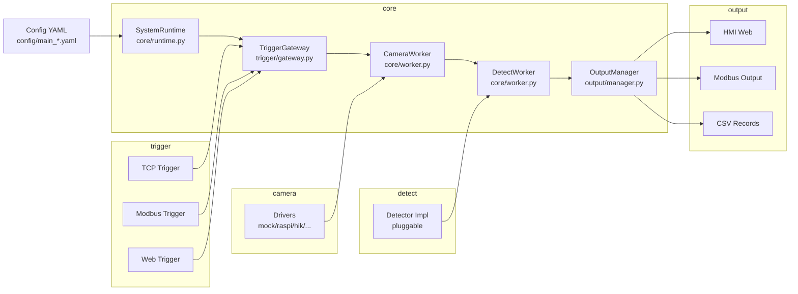

# Smart Camera

Config-driven industrial vision service for production lines, with web HMI, Modbus output, and pluggable camera/trigger/detector modules.

## Features

- Pluggable camera drivers (mock, raspi, hik/opt when available)
- Trigger inputs (TCP, Modbus, Web)
- Outputs (HMI web, Modbus, CSV)
- Config-driven runtime via YAML

## Architecture



## Web HMI


Live status, last-N records, and the latest preview image. Served at `http://<comm.http.host>:<comm.http.port>` when `output.enable_http` is true (defaults `0.0.0.0:8000`).

## Quick Start

```bash
python -m venv .venv
# Windows PowerShell
.venv\Scripts\Activate.ps1
# Linux/macOS
source .venv/bin/activate
pip install -r requirements.txt
python main.py --config-dir config
```

## Configuration

Main config must be exactly one file: `config/main_*.yaml`. Detect config is referenced by `detect.config_file`.

Core sections:

- `runtime`: save_dir, history_size, debounce, log level
- `camera`: driver, exposure, image save options
- `trigger`: TCP/Modbus settings and filters
- `comm`: TCP/Modbus/HTTP ports
- `detect`: detector impl and config file
- `output`: enable HMI/Modbus/CSV

### Raspberry Pi camera (Picamera2)

```yaml
imports:
  - "camera.raspi"

camera:
  type: "raspi"
  width: 4056
  height: 3040
  ae_enable: false
  awb_enable: false
  exposure_us: 100000
  analogue_gain: 1.0
  frame_duration_us: 100000
  settle_ms: 200
  use_still: true
```

Notes:

- `exposure_us` is in microseconds.
- When `ae_enable` is false, `frame_duration_us` must be >= `exposure_us`.
- For headless systems, consider `opencv-python-headless`.

### Mock camera

```yaml
imports:
  - "camera.mock"

camera:
  type: "mock"
  image_dir: "data/mock_images"
```

## Outputs

- Images: `<runtime.save_dir>/images` when `camera.save_images` is true (default)
- CSV: `<runtime.save_dir>/records.csv` when `output.write_csv` is true

## Contributing

See `CONTRIBUTING.md` for how to report issues and submit PRs.

## License

MIT License. See `LICENSE`.
