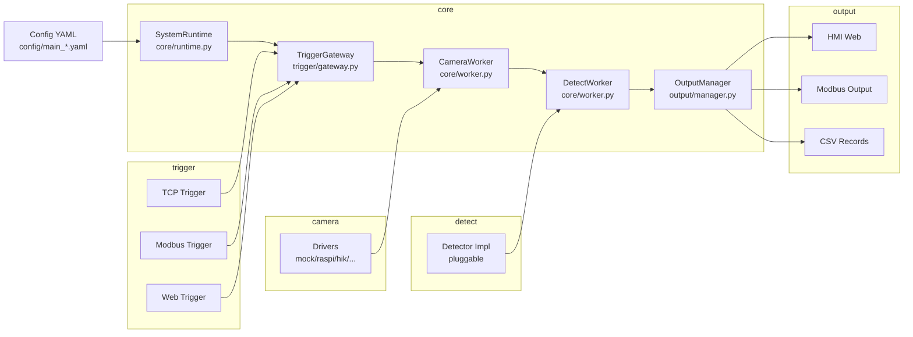
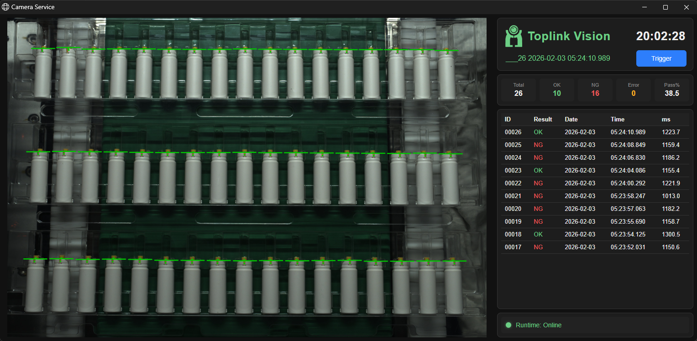

# VisionRuntime

Config-driven industrial vision service for production lines, with web HMI, Modbus output, and pluggable camera/trigger/detector modules.

## Features

- Pluggable camera drivers (mock, raspi, hik/opt when available)
- Trigger inputs (TCP, Modbus, Web)
- Outputs (Web HMI, Modbus, CSV)
- Config-driven runtime via YAML

## Architecture



## Web HMI



Live status, last-N records, and the latest preview image. Served at `http://<comm.http.host>:<comm.http.port>` when `output.hmi.enabled` is true (defaults `0.0.0.0:8000`).

## Quick Start

```bash
python -m venv .venv
# Windows PowerShell
.venv\Scripts\Activate.ps1
# Linux/macOS
source .venv/bin/activate
pip install -r requirements.txt
python main.py --config-dir config
```

## Deployment

See `docs/deploy.md` for a Linux/Ubuntu deployment guide and systemd unit example.

## Configuration

Main config must be exactly one file: `config/main_*.yaml` or `config/main_*.yml`. Detect config is referenced by `detect.config_file`.

Core sections:

- `runtime`: save_dir, max_runtime_s, detect_queue_capacity, log_level
- `camera`: driver, exposure, image save options
- `trigger`: debounce + TCP/Modbus settings and filters
- `comm`: TCP/Modbus/HTTP ports
- `detect`: detector implementation and config file / preview settings
- `output`: HMI/Modbus/CSV switches (including `output.hmi.history_size`)

Camera config is split by implementation: use `camera.common` for shared fields and `camera.<type>` for adapter-specific fields (for example `camera.mock`, `camera.raspi`, `camera.opt`, `camera.hik`).

### Raspberry Pi camera (Picamera2)

```yaml
camera:
  type: "raspi"
  common:
    width: 4056
    height: 3040
  raspi:
    ae_enable: false
    awb_enable: false
    exposure_us: 100000
    analogue_gain: 1.0
    frame_duration_us: 100000
    settle_ms: 200
    use_still: true
```

Notes:

- `exposure_us` is in microseconds.
- When `ae_enable` is false, `frame_duration_us` must be >= `exposure_us`.
- For headless systems, consider `opencv-python-headless`.

### Mock camera

```yaml
camera:
  type: "mock"
  common:
    save_images: false
  mock:
    image_dir: "data/mock_images"
```

For built-in modules, `imports` is usually not required; keep it for custom/external plugins that must be preloaded.

## Outputs

- Images: `<runtime.save_dir>/images` when camera image saving is enabled (typically `camera.common.save_images: true`)
- CSV: `<runtime.save_dir>/images/YYYY-MM-DD/records.csv` when `output.write_csv` is true

## Optional Tools

- Backup Streamlit HMI: `debug_tools/streamlit_hmi.py`
- Optional deps: `pip install -r requirements-tools-streamlit.txt`

## Contributing

See `CONTRIBUTING.md` for how to report issues and submit PRs.

## Tests

- Minimal flow test config: `config/tests/main_test.yaml`
- Test images: `data/test/ok.png`, `data/test/ng.png`
- Run: `python -m unittest discover -s tests -v`

## License

MIT License. See `LICENSE`.
