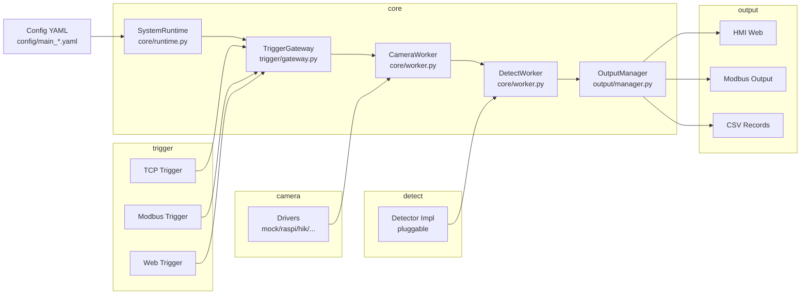
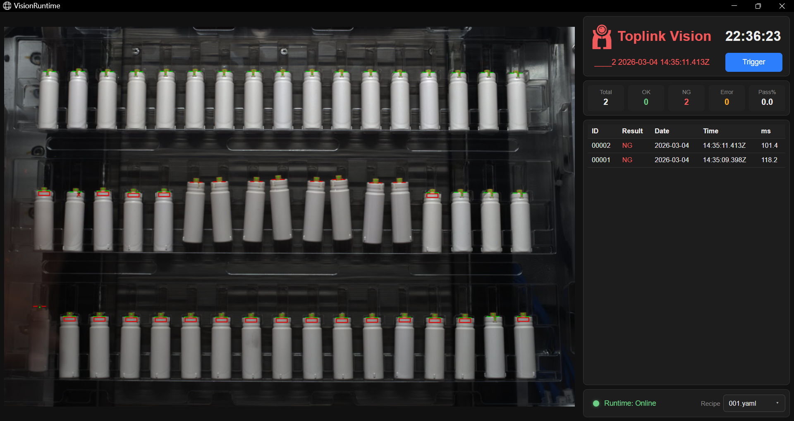

# VisionRuntime

Deployable, config-driven vision runtime for real-world production-line inspection.

VisionRuntime is an industrial vision service designed for production environments.  
It focuses not only on running detection logic, but also on maintainability, pluggable integration, and deployment-oriented operation.

## Overview

This project provides a configurable runtime for factory inspection workflows, with:

- pluggable camera, trigger, detector, and output modules
- web HMI for live status and recent records
- Modbus and CSV outputs for system integration
- YAML-based runtime configuration and detector recipe loading

It is intended for scenarios where inspection software needs to be integrated into a larger automation system rather than used as a standalone demo.

## Highlights

- **Config-first runtime** for maintainable inspection workflows
- **Pluggable modules** for cameras, triggers, detectors, and outputs
- **Web HMI + Modbus integration** for production-line environments
- **YAML-based configuration** for runtime behavior and detector recipes
- **Deployment-oriented structure** suitable for long-running service operation

## Architecture


```mermaid
flowchart LR
  Config[Config YAML<br/>config/main_*.yaml] --> Runtime

  subgraph core[core]
    Runtime[SystemRuntime<br/>core/runtime.py]
    Gateway[TriggerGateway<br/>trigger/gateway.py]
    CamWorker[CameraWorker<br/>core/worker.py]
    DetWorker[DetectWorker<br/>core/worker.py]
    OutMgr[OutputManager<br/>output/manager.py]
  end

  subgraph trigger[trigger]
    TCP[TCP Trigger]
    ModbusT[Modbus Trigger]
    WebT[Web Trigger]
  end

  subgraph camera[camera]
    Drivers[Drivers<br/>mock/raspi/hik/...]
  end

  subgraph detect[detect]
    Detector[Detector Impl<br/>pluggable]
  end

  subgraph output[output]
    HMI[HMI Web]
    ModbusO[Modbus Output]
    CSV[CSV Records]
  end

  Runtime --> Gateway
  TCP --> Gateway
  ModbusT --> Gateway
  WebT --> Gateway
  Gateway --> CamWorker
  Drivers --> CamWorker
  CamWorker --> DetWorker
  Detector --> DetWorker
  DetWorker --> OutMgr
  OutMgr --> HMI
  OutMgr --> ModbusO
  OutMgr --> CSV
```

## Web HMI



The built-in Web HMI provides:

- live runtime status
- recent inspection records
- the latest preview image

It is served at:

`http://<comm.http.host>:<comm.http.port>`

when `output.hmi.enabled` is `true`  
(default: `0.0.0.0:8000`).

## Quick Start

```bash
python -m venv .venv

# Windows PowerShell
.venv\Scripts\Activate.ps1

# Linux/macOS
source .venv/bin/activate
pip install -r requirements.txt

python main.py --config-dir config
```

## Deployment

For Linux/Ubuntu deployment and a `systemd` service example, see:

- `docs/deploy.md`

## Configuration

Runtime behavior is controlled by YAML configuration.

The main config must be exactly one file:

- `config/main_*.yaml`
- or `<config-dir>/main_*.yml`

Detection recipes are loaded from `detect.recipe_dir`, with startup default set by `detect.default_recipe`.

### Core sections

- `runtime`  
  save directory, runtime limits, queue capacity, log level

- `camera`  
  driver selection, exposure, image save options

- `trigger`  
  debounce behavior, TCP/Modbus settings, and filters

- `comm`  
  TCP / Modbus / HTTP ports

- `detect`  
  detector implementation, recipe directory/default, switch guard, preview settings

- `output`  
  HMI / Modbus / CSV switches, including `output.hmi.history_size` and optional `output.overlay_archive`

### Camera configuration pattern

Camera configuration is split by implementation:

- `camera.common` for shared fields
- `camera.<type>` for adapter-specific fields

Examples of adapter-specific sections include:

- `camera.mock`
- `camera.raspi`
- `camera.opt`
- `camera.hik`

### Raspberry Pi camera (Picamera2)

```yaml
camera:
  type: "raspi"
  common:
    width: 4056
    height: 3040
  raspi:
    ae_enable: false
    awb_enable: false
    exposure_us: 100000
    analogue_gain: 1.0
    frame_duration_us: 100000
    settle_ms: 200
    use_still: true
```

Notes:

- `exposure_us` is in microseconds.
- When `ae_enable` is false, `frame_duration_us` must be >= `exposure_us`.
- For headless systems, consider `opencv-python-headless`.

### Mock camera

```yaml
camera:
  type: "mock"
  common:
    save_images: false
  mock:
    image_dir: "data/mock_images"
```

For built-in modules, `imports` is usually not required; keep it for custom/external plugins that must be preloaded.

## Outputs

### Images

Saved to:

`<runtime.save_dir>/images`

when image saving is enabled and supported by the selected adapter.

Current behavior:

- supported by `opt` / `hik`
- not persisted by `mock` / `raspi` in the current implementation

### CSV

Saved to:

`<runtime.save_dir>/images/YYYY-MM-DD/records.csv`

when `output.write_csv` is `true`.

## Optional Tools

- Backup Streamlit HMI: `debug_tools/streamlit_hmi.py`
- Optional manual dependencies:

```bash
pip install streamlit streamlit-autorefresh requests
```

Note:

- `debug_tools/streamlit_hmi.py` reads `/status` timestamps from `triggered_at_ms`

## Tests

- Minimal flow test config: `config/tests/main_test.yaml`
- Test images:
  - `data/test/ok.png`
  - `data/test/ng.png`

Run tests with:

```bash
python -m unittest discover -s tests -v
```

## Contributing

See `CONTRIBUTING.md` for issue reporting and pull request guidelines.

## License

MIT License. See `LICENSE`.
